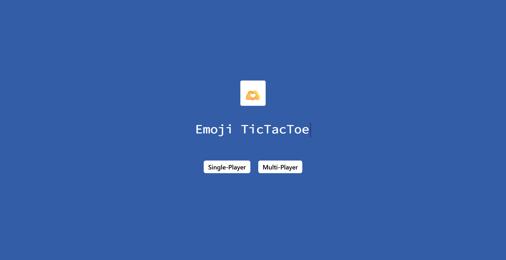
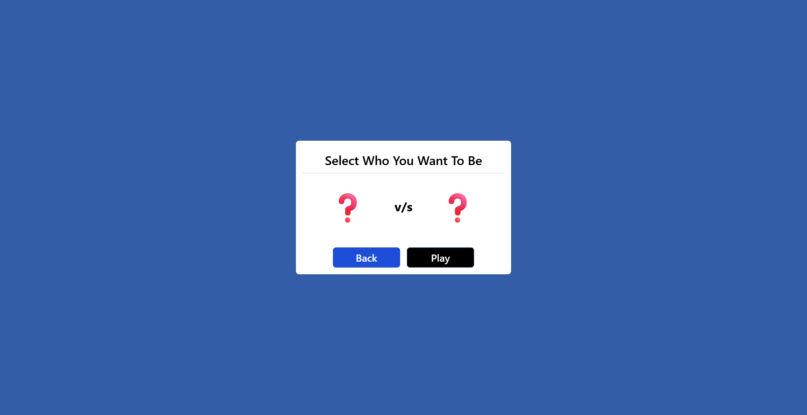
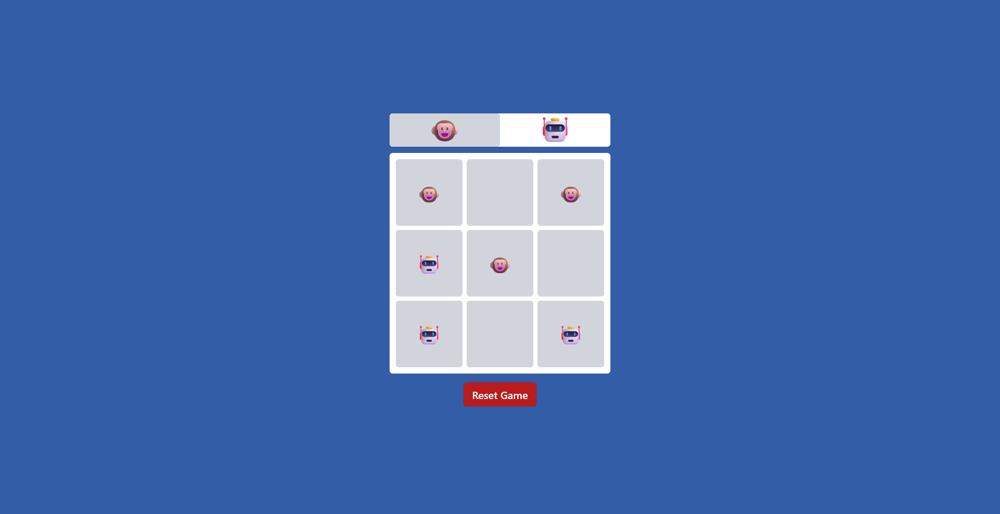
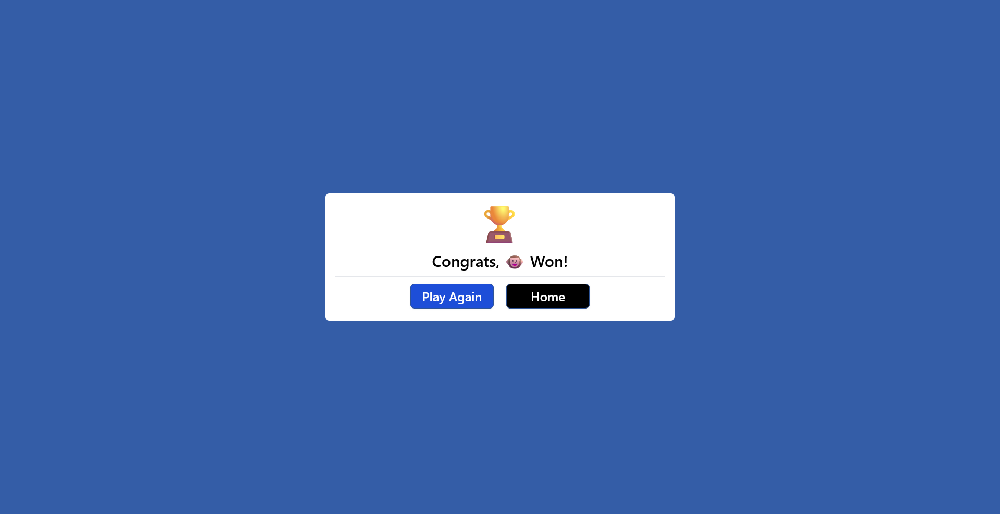

<h1 align="center">Emoji TicTacToe</h1>

  
  

  <strong>A modern twist on the classic TicTacToe game, now with emojis!</strong>

---

## 🎮 Features

- **Emoji Fun**: Instead of boring Xs and Os, enjoy playing with a variety of emojis that bring joy to your gaming experience.
- **Single Player & Local Multiplayer**: Challenge yourself against the computer with adjustable difficulty levels or play with friends in local multiplayer mode.
- **Responsive Design**: Seamlessly play the game on any device, from desktops to smartphones, thanks to its responsive design.
- **Stunning Animations**: Dive into immersive gameplay with fluid animations and transitions powered by Framer Motion.
- **Simple Setup**: Get started with just a few simple steps, and you'll be enjoying Emoji TicTacToe in no time!

## 🛠️ Technologies Used

- **React**: A cutting-edge JavaScript library for building dynamic user interfaces.
- **Tailwind CSS**: Utilize the power of utility-first CSS framework for rapid and beautiful styling.
- **Framer Motion**: Elevate user experience with smooth animations and delightful interactions.

## 🚀 Getting Started

1. **Clone the Repository**: `git clone https://github.com/MishanPoudel/Emoji-TicTacToe.git`
2. **Navigate to the Directory**: `cd emoji-tictactoe`
3. **Install Dependencies**: `npm install`
4. **Start the Development Server**: `npm start`
5. **Open Your Browser**: Visit `http://localhost:3000` and enjoy playing Emoji TicTacToe!

## 🎯 How to Play

- **Single Player Mode**: Select your preferred difficulty level (easy or hard) and make your moves by clicking on the squares on the board. Aim to beat the computer by forming a line of three emojis either horizontally, vertically, or diagonally.
- **Local Multiplayer Mode**: Play against a friend by taking turns to make moves. The player who succeeds in forming a line of three emojis first wins the game.

## 🖼️ Game Demo

  
  
  

## 🤝 Contributing

Contributions to Emoji TicTacToe are highly appreciated! Whether it's bug fixes, feature enhancements, or suggestions, feel free to open an issue or submit a pull request. Let's make Emoji TicTacToe even better together!

## ⭐ Support

If you find Emoji TicTacToe helpful or you like what we're doing, please consider giving the repository a star! It's a quick way to show your support for this project.

  

